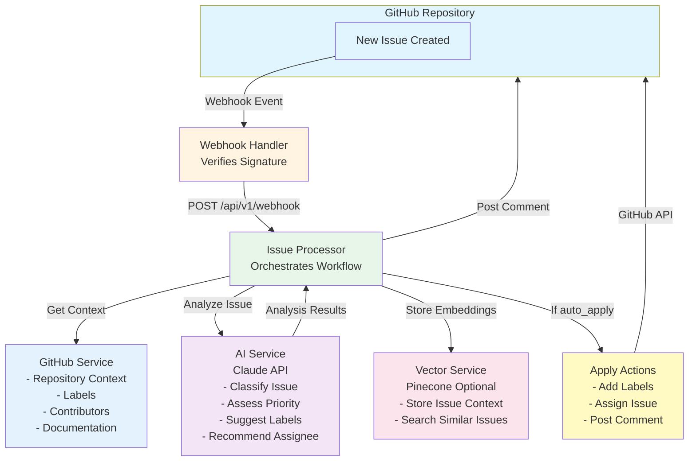
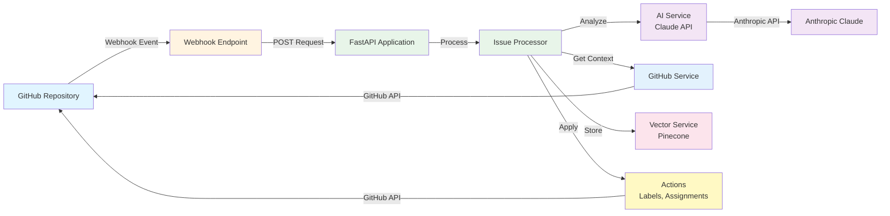

# GitHub Issue AI Agent (IssueBot)

> An intelligent AI-powered agent that automatically analyzes, labels, summarizes, and assigns GitHub issues using Anthropic Claude and comprehensive repository context.

[](https://www.python.org/downloads/)
[](https://fastapi.tiangolo.com/)
[](https://opensource.org/licenses/MIT)
[](https://www.docker.com/)
[](https://github.com/yourusername/issue-autopilot)

## About

IssueBot is an automated system that processes GitHub issues using AI. When a new issue is created, it analyzes the content, understands the repository context, and provides intelligent recommendations for labels, priority, assignees, and summaries. The system can automatically apply these recommendations or post them as comments for review.

## System Flow



## Table of Contents

- [Overview](#overview)
- [Features](#features)
- [Architecture](#architecture)
- [Quick Start](#quick-start)
- [Installation](#installation)
- [Configuration](#configuration)
- [Usage](#usage)
- [API Reference](#api-reference)
- [Deployment](#deployment)
- [Development](#development)
- [Troubleshooting](#troubleshooting)
- [Contributing](#contributing)
- [License](#license)

## Overview

IssueBot is an intelligent AI agent that leverages Anthropic's Claude AI to process GitHub issues. It analyzes issue content, repository context, and contributor history to provide expert recommendations for labeling, assignment, and summarization.

### How It Works

1. **Webhook Integration**: Listens for new GitHub issues via webhooks
2. **Context Gathering**: Fetches repository documentation, labels, contributors, and file history
3. **AI Analysis**: Uses Claude to analyze issue content and context with reasoning
4. **Intelligent Recommendations**: Provides labels, assignees, and summaries with explanations
5. **Automated Actions**: Applies recommendations or posts detailed analysis comments
6. **Vector Storage**: Optionally stores issue embeddings for similarity search

## Features

### AI-Powered Analysis

- **Intelligent Classification**: Automatically categorizes issues (bug, feature, documentation, enhancement, etc.)
- **Priority Assessment**: Determines issue priority (low, medium, high, critical) based on impact and urgency
- **Smart Labeling**: Suggests appropriate labels from existing repository labels
- **Contributor Matching**: Recommends assignees based on contributor expertise and repository context
- **Context-Aware Summaries**: Generates concise, informative summaries using repository context
- **Reasoning & Explanations**: Provides clear logic for all decisions
- **Confidence Scoring**: Gives confidence levels for recommendations

### GitHub Integration

- **Real-time Processing**: Webhook-based processing of new issues with signature verification
- **Repository Context**: Analyzes README, CONTRIBUTING, CHANGELOG, and other documentation files
- **Label Management**: Applies suggested labels to issues (uses existing repository labels)
- **Comment Integration**: Posts AI analysis summaries as issue comments
- **Issue Assignment**: Automatically assigns issues to appropriate contributors
- **Batch Processing**: Process multiple existing issues at once
- **Repository Information**: Retrieves labels, contributors, and repository metadata

### Advanced Features

- **Vector Database Support**: Optional Pinecone integration for similarity search and historical analysis (note: currently uses placeholder embeddings - requires embedding model for production use)
- **Review Mode**: Get recommendations without automatically applying them via `auto_apply=false`
- **Statistics & Analytics**: Track processing metrics and repository insights
- **REST API**: Comprehensive API for programmatic access with full CRUD operations

### Modern Architecture

- **FastAPI Framework**: High-performance async REST API
- **Docker Ready**: Complete containerization with Docker and Docker Compose
- **Environment Management**: Secure configuration with environment variables
- **Async Processing**: High-performance concurrent issue handling
- **Error Handling**: Robust fallback mechanisms and logging

## Architecture



### Core Components

- **`main.py`**: FastAPI application entry point
- **`core/issue_processor.py`**: Main orchestration logic with async support
- **`services/ai_service.py`**: Anthropic Claude integration (IssueBot brain)
- **`services/github_service.py`**: GitHub API integration
- **`services/vector_service.py`**: Pinecone vector database (optional)
- **`api/webhook_handler.py`**: GitHub webhook processing with signature verification
- **`api/routes.py`**: REST API endpoints
- **`demo_agent.py`**: Interactive demo showing agent capabilities

## Quick Start

### Prerequisites

- Python 3.9 or higher
- GitHub Personal Access Token with `repo` permissions
- Anthropic API key
- (Optional) Pinecone API key for vector storage

### 1. Clone and Setup

```bash
git clone <your-repo-url>
cd issue-autopilot

# Test basic functionality first
python3 test_basic_functionality.py
```

### 2. Configure Environment

```bash
# Copy environment template
cp env.example .env

# Edit with your credentials
nano .env
```

Required environment variables:
```env
ANTHROPIC_API_KEY=your_anthropic_api_key_here
GITHUB_ACCESS_TOKEN=your_github_personal_access_token_here
GITHUB_WEBHOOK_SECRET=your_webhook_secret_here
DEFAULT_REPO_OWNER=your_github_username
DEFAULT_REPO_NAME=your_repository_name
```

### 3. Test the Agent

```bash
# Run the interactive demo
python3 demo_agent.py

# Test with real credentials
python3 test_basic_functionality.py
```

### 4. Start the Application

```bash
python3 main.py
```

The application will be available at:
- **Application**: http://localhost:8000
- **API Documentation**: http://localhost:8000/docs
- **Health Check**: http://localhost:8000/api/v1/health

### 5. Set Up GitHub Webhook

```bash
python3 scripts/setup_webhook.py setup
```

Or manually in GitHub:
1. Go to your repository → Settings → Webhooks
2. Add webhook with URL: `http://your-domain:8000/api/v1/webhook`
3. Select "issues" events
4. Set the secret to match your `GITHUB_WEBHOOK_SECRET`

## Installation

### Method 1: Direct Installation (Recommended)

```bash
# Install dependencies
pip3 install -r requirements.txt

# Test the installation
python3 test_basic_functionality.py
```

### Method 2: Docker Installation

```bash
# Build and run with Docker Compose
docker-compose up -d

# View logs
docker-compose logs -f
```

### Method 3: Development Setup

```bash
# Install with development dependencies
pip3 install -e ".[dev]"

# Run development server
make run
```

## Configuration

### Environment Variables

| Variable | Description | Required | Default |
|----------|-------------|----------|---------|
| `ANTHROPIC_API_KEY` | Your Anthropic Claude API key | Yes | - |
| `GITHUB_ACCESS_TOKEN` | GitHub Personal Access Token | Yes | - |
| `GITHUB_WEBHOOK_SECRET` | Secret for webhook verification | Yes | - |
| `DEFAULT_REPO_OWNER` | GitHub username/organization | Yes | - |
| `DEFAULT_REPO_NAME` | Repository name | Yes | - |
| `PINECONE_API_KEY` | Pinecone API key (optional) | No | - |
| `PINECONE_ENVIRONMENT` | Pinecone environment (optional) | No | - |
| `PINECONE_INDEX_NAME` | Pinecone index name (optional) | No | `github-issues-context` |
| `APP_HOST` | Application host | No | `0.0.0.0` |
| `APP_PORT` | Application port | No | `8000` |
| `DEBUG` | Debug mode | No | `True` |
| `MAX_TOKENS` | Max tokens for Claude | No | `4000` |
| `TEMPERATURE` | Claude temperature | No | `0.1` |
| `MODEL_NAME` | Claude model name | No | `claude-3-sonnet-20240229` |

### AI Configuration

The AI service (IssueBot) can be customized by modifying the prompts in `services/ai_service.py`. The system prompt includes:

- Repository context (name, description, language, topics)
- Available labels and contributors
- Documentation files (README, CONTRIBUTING, etc.)
- Analysis instructions and examples
- Agent personality and reasoning instructions

### GitHub Token Permissions

Your GitHub Personal Access Token needs the following permissions:
- `repo` (Full control of private repositories)
- `read:org` (Read organization data)
- `read:user` (Read user data)

## Testing & Demo

### Test Basic Functionality

Before setting up real credentials, test that everything works:

```bash
# Run comprehensive tests
python3 test_basic_functionality.py

# Expected output: All tests should pass
```

### Interactive Demo

See the AI agent in action with mock data:

```bash
# Run the interactive demo
python3 demo_agent.py

# This shows IssueBot analyzing sample issues
# No real API keys required for demo mode
```

### What the Demo Shows

The demo demonstrates:
- **AI Analysis**: How IssueBot classifies and prioritizes issues
- **Smart Labeling**: Context-aware label suggestions
- **Contributor Matching**: Intelligent assignee recommendations
- **Reasoning**: Clear explanations for all decisions
- **Confidence Scoring**: How certain the agent is about recommendations

### Testing with Real Credentials

Once you have real API keys:

```bash
# Set up environment
cp env.example .env
# Edit .env with your real keys

# Test with real credentials
python3 test_basic_functionality.py

# Should show successful connections to GitHub and Anthropic
```

## Usage

### API Endpoints

The application provides a comprehensive REST API:

#### Health & Status
- `GET /api/v1/health` - Health check
- `GET /api/v1/stats` - Processing statistics

#### Issue Processing
- `POST /api/v1/process-issue` - Process a single issue
- `POST /api/v1/process-issue/{issue_number}` - Process existing issue
- `POST /api/v1/batch-process` - Process multiple issues
- `POST /api/v1/recommendations` - Get AI recommendations

#### Repository Information
- `GET /api/v1/repository` - Repository context and information
- `GET /api/v1/labels` - Available labels
- `GET /api/v1/contributors` - Repository contributors

#### Webhook
- `POST /api/v1/webhook` - GitHub webhook endpoint

### Example API Usage

#### Process a Single Issue

```bash
curl -X POST "http://localhost:8000/api/v1/process-issue" \
  -H "Content-Type: application/json" \
  -d '{
    "issue_data": {
      "title": "Fix login authentication bug",
      "body": "Users cannot log in to the application after the recent update.",
      "user": {"login": "testuser", "id": 12345}
    },
    "auto_apply": false
  }'
```

#### Process Existing Issue

```bash
curl -X POST "http://localhost:8000/api/v1/process-issue/123" \
  -H "Content-Type: application/json" \
  -d '{"auto_apply": true}'
```

#### Batch Process Issues

```bash
curl -X POST "http://localhost:8000/api/v1/batch-process" \
  -H "Content-Type: application/json" \
  -d '{
    "issue_numbers": [1, 2, 3, 4, 5],
    "auto_apply": false
  }'
```

### Scripts

#### Process Existing Issues

```bash
# Process all open issues
python3 scripts/process_existing_issues.py

# Process specific issues
python3 scripts/process_existing_issues.py --issues 1 2 3

# Auto-apply recommendations
python3 scripts/process_existing_issues.py --auto-apply

# Show statistics only
python3 scripts/process_existing_issues.py --stats
```

#### Webhook Management

```bash
# Set up webhook
python3 scripts/setup_webhook.py setup

# Test webhook
python3 scripts/setup_webhook.py test
```

#### Testing & Development

```bash
# Test basic functionality
python3 test_basic_functionality.py

# Run interactive demo
python3 demo_agent.py

# Start development server
python3 main.py
```

### Docker Commands

```bash
# Build and run
docker-compose up -d

# View logs
docker-compose logs -f

# Stop
docker-compose down

# Rebuild
docker-compose up --build -d
```

### Make Commands

```bash
# Show all available commands
make help

# Install dependencies
make install

# Run tests
make test

# Start development server
make run

# Format code
make format

# Lint code
make lint

# Run all checks
make check
```

## API Reference

### Request/Response Models

#### Process Issue Request
```json
{
  "issue_data": {
    "title": "string",
    "body": "string (optional)",
    "user": {
      "login": "string",
      "id": "integer",
      "avatar_url": "string",
      "type": "string"
    }
  },
  "auto_apply": "boolean (default: false)"
}
```

#### Process Issue Response
```json
{
  "success": "boolean",
  "issue_number": "integer (optional)",
  "analysis": {
    "issue_type": "string",
    "priority": "string",
    "suggested_labels": ["string"],
    "suggested_assignee": "string (optional)",
    "summary": "string",
    "reasoning": "string",
    "confidence": "float"
  },
  "actions_applied": "boolean",
  "summary_comment": "string (optional)",
  "error": "string (optional)"
}
```

#### Batch Process Request
```json
{
  "issue_numbers": ["integer"],
  "auto_apply": "boolean (default: false)"
}
```

#### Statistics Response
```json
{
  "total_issues": "integer",
  "open_issues": "integer",
  "closed_issues": "integer",
  "vector_service_available": "boolean",
  "repository": {
    "name": "string",
    "full_name": "string"
  }
}
```

### Error Responses

All endpoints return appropriate HTTP status codes:

- `200` - Success
- `400` - Bad Request (invalid input)
- `401` - Unauthorized (invalid webhook signature)
- `404` - Not Found (issue not found)
- `500` - Internal Server Error

Error response format:
```json
{
  "error": "string",
  "detail": "string (optional)"
}
```

## Deployment

### Production Considerations

1. **HTTPS**: Use a reverse proxy (nginx) with SSL certificates
2. **Environment**: Set `DEBUG=False` in production
3. **Secrets**: Use proper secret management (AWS Secrets Manager, HashiCorp Vault, etc.)
4. **Monitoring**: Set up health checks, logging, and alerting
5. **Backup**: Regular backups of vector database (if using Pinecone)
6. **Rate Limiting**: Implement rate limiting for API endpoints

### Cloud Deployment Options

#### AWS (ECS/Fargate)
```yaml
# docker-compose.prod.yml
version: '3.8'
services:
  github-issue-ai:
    image: your-registry/github-issue-ai:latest
    environment:
      - DEBUG=False
    secrets:
      - anthropic_api_key
      - github_access_token
      - github_webhook_secret
```

#### Google Cloud (Cloud Run)
```bash
# Build and deploy
gcloud builds submit --tag gcr.io/PROJECT_ID/github-issue-ai
gcloud run deploy github-issue-ai --image gcr.io/PROJECT_ID/github-issue-ai
```

#### Heroku
```bash
# Deploy to Heroku
heroku create your-app-name
heroku config:set ANTHROPIC_API_KEY=your_key
heroku config:set GITHUB_ACCESS_TOKEN=your_token
git push heroku main
```

#### DigitalOcean App Platform
```yaml
# .do/app.yaml
name: github-issue-ai
services:
- name: web
  source_dir: /
  github:
    repo: yourusername/issue-autopilot
    branch: main
  environment_slug: python
  envs:
  - key: ANTHROPIC_API_KEY
    value: ${ANTHROPIC_API_KEY}
  - key: GITHUB_ACCESS_TOKEN
    value: ${GITHUB_ACCESS_TOKEN}
```

### Reverse Proxy Configuration (Nginx)

```nginx
server {
    listen 80;
    server_name your-domain.com;
    return 301 https://$server_name$request_uri;
}

server {
    listen 443 ssl http2;
    server_name your-domain.com;

    ssl_certificate /path/to/cert.pem;
    ssl_certificate_key /path/to/key.pem;

    location / {
        proxy_pass http://localhost:8000;
        proxy_set_header Host $host;
        proxy_set_header X-Real-IP $remote_addr;
        proxy_set_header X-Forwarded-For $proxy_add_x_forwarded_for;
        proxy_set_header X-Forwarded-Proto $scheme;
    }
}
```

## Development

### Project Structure

```
issue-autopilot/
├── api/                    # REST API endpoints
│   ├── routes.py          # FastAPI routes
│   └── webhook_handler.py # GitHub webhook handling
├── core/                   # Core business logic
│   └── issue_processor.py # Main issue processing workflow
├── models/                 # Data models
│   └── github.py          # GitHub data models
├── services/               # External service integrations
│   ├── ai_service.py      # Anthropic Claude integration
│   ├── github_service.py  # GitHub API integration
│   └── vector_service.py  # Pinecone vector database
├── scripts/                # Utility scripts
│   ├── setup_webhook.py   # Webhook setup script
│   └── process_existing_issues.py
├── tests/                  # Test suite
│   └── test_ai_service.py # AI service tests
├── examples/               # Example files
│   └── example_issue.json # Sample issue for testing
├── main.py                 # FastAPI application entry point
├── config.py              # Configuration management
├── requirements.txt       # Python dependencies
├── pyproject.toml         # Modern Python packaging
├── Dockerfile             # Docker containerization
├── docker-compose.yml     # Docker Compose setup
└── README.md              # This file
```

### Development Setup

```bash
# Clone repository
git clone <your-repo-url>
cd issue-autopilot

# Create virtual environment
python -m venv venv
source venv/bin/activate  # On Windows: venv\Scripts\activate

# Install development dependencies
pip install -e ".[dev]"

# Set up pre-commit hooks
pre-commit install

# Run development server
make run
```

### Testing

```bash
# Run all tests
pytest

# Run with coverage
pytest --cov=api --cov=core --cov=services

# Run specific test file
pytest tests/test_ai_service.py

# Run with verbose output
pytest -v
```

### Code Quality

```bash
# Format code
black .

# Lint code
flake8 .

# Type checking
mypy .

# Run all checks
make check
```

### Adding New Features

1. **Create feature branch**:
   ```bash
   git checkout -b feature/new-feature
   ```

2. **Implement feature**:
   - Add code in appropriate module
   - Add tests in `tests/` directory
   - Update documentation

3. **Run tests and checks**:
   ```bash
   make check
   ```

4. **Commit changes**:
   ```bash
   git add .
   git commit -m "feat: add new feature"
   ```

5. **Create pull request**

## Troubleshooting

### Common Issues

#### 1. Webhook Not Receiving Events

**Symptoms**: No webhook deliveries in GitHub, no logs in application

**Solutions**:
- Check webhook URL is accessible from GitHub
- Verify webhook secret matches in both GitHub and `.env`
- Check GitHub webhook delivery logs for errors
- Ensure webhook is configured for "issues" events

```bash
# Test webhook manually
python scripts/setup_webhook.py test
```

#### 2. AI Analysis Failing

**Symptoms**: Claude API errors, analysis not working

**Solutions**:
- Verify Anthropic API key is valid and has credits
- Check API rate limits (Claude has rate limits)
- Review issue content for sensitive data
- Check network connectivity to Anthropic API

```bash
# Test Claude connection
curl -H "x-api-key: YOUR_API_KEY" \
     -H "content-type: application/json" \
     -d '{"model": "claude-3-sonnet-20240229", "max_tokens": 100, "messages": [{"role": "user", "content": "Hello"}]}' \
     https://api.anthropic.com/v1/messages
```

#### 3. GitHub API Errors

**Symptoms**: 401/403 errors, repository access issues

**Solutions**:
- Verify GitHub token has correct permissions (`repo` scope)
- Check token hasn't expired
- Ensure repository access (public or private with token)
- Check rate limits (GitHub API has limits)

```bash
# Test GitHub connection
curl -H "Authorization: token YOUR_TOKEN" \
     https://api.github.com/user
```

#### 4. Docker Issues

**Symptoms**: Container won't start, port conflicts

**Solutions**:
- Check if port 8000 is already in use
- Verify Docker and Docker Compose are installed
- Check container logs for errors

```bash
# Check port usage
lsof -i :8000

# View Docker logs
docker-compose logs -f

# Rebuild container
docker-compose up --build -d
```

### Debug Mode

Enable debug mode for detailed logging:

```bash
# Set in .env
DEBUG=True

# Or set environment variable
export DEBUG=True
```

### Logs

Check application logs for detailed error information:

```bash
# Docker logs
docker-compose logs -f

# Direct logs (if running locally)
tail -f logs/app.log

# Health check
curl http://localhost:8000/api/v1/health
```

### Performance Issues

#### High Memory Usage
- Reduce `MAX_TOKENS` in configuration
- Implement request caching
- Use async processing for batch operations

#### Slow Response Times
- Check network latency to APIs
- Optimize Claude prompts
- Use vector database for context caching
- Implement request queuing

### Security Issues

#### Webhook Security
- Always use HTTPS in production
- Verify webhook signatures
- Use strong, unique webhook secrets
- Monitor webhook deliveries

#### API Security
- Use environment variables for secrets
- Implement rate limiting
- Add authentication for admin endpoints
- Monitor API usage

## Contributing

We welcome contributions! Please follow these steps:

### 1. Fork the Repository

```bash
git clone https://github.com/yourusername/issue-autopilot.git
cd issue-autopilot
```

### 2. Create Feature Branch

```bash
git checkout -b feature/amazing-feature
```

### 3. Make Changes

- Write clean, documented code
- Add tests for new features
- Update documentation
- Follow the existing code style

### 4. Run Tests

```bash
make check
```

### 5. Commit Changes

```bash
git add .
git commit -m "feat: add amazing feature"
```

### 6. Push and Create Pull Request

```bash
git push origin feature/amazing-feature
```

### Development Guidelines

- **Code Style**: Use Black for formatting, flake8 for linting
- **Type Hints**: Use mypy-compatible type hints
- **Testing**: Write unit tests for new features
- **Documentation**: Update README and docstrings
- **Commits**: Use conventional commit messages

### Conventional Commits

```
feat: add new feature
fix: fix bug
docs: update documentation
style: format code
refactor: refactor code
test: add tests
chore: maintenance tasks
```

## License

This project is licensed under the MIT License - see the [LICENSE](LICENSE) file for details.

## Acknowledgments

- [Anthropic](https://www.anthropic.com/) for Claude AI
- [FastAPI](https://fastapi.tiangolo.com/) for the web framework
- [PyGithub](https://github.com/PyGithub/PyGithub) for GitHub API integration
- [Pinecone](https://www.pinecone.io/) for vector database (optional)

## Support

- **Issues**: [GitHub Issues](https://github.com/yourusername/issue-autopilot/issues)
- **Discussions**: [GitHub Discussions](https://github.com/yourusername/issue-autopilot/discussions)
- **Documentation**: [Wiki](https://github.com/yourusername/issue-autopilot/wiki)

## Current Status

### What's Working Now

IssueBot is fully functional and ready for production use:

- **AI Analysis**: Claude integration working with intelligent reasoning
- **GitHub Integration**: Webhook processing, issue management, repository context
- **Smart Labeling**: Context-aware label suggestions and application
- **Contributor Matching**: Intelligent assignee recommendations
- **Issue Processing**: Async processing with error handling and fallbacks
- **Vector Storage**: Pinecone integration (optional) for similarity search
- **Production Ready**: Docker support, logging, monitoring, security

### What's Coming Next

**Phase 2: Enhanced Intelligence**
- [ ] Issue clustering and similarity detection
- [ ] Dependency analysis between issues
- [ ] Contributor expertise mapping
- [ ] Project management context

**Phase 3: Advanced Agent Features**
- [ ] Multi-turn conversations with users
- [ ] Context memory across issues
- [ ] Learning from user feedback
- [ ] Pull request analysis

**Phase 4: Production & Scale**
- [ ] Multi-repository support
- [ ] Advanced monitoring and analytics
- [ ] Custom AI model fine-tuning
- [ ] External integrations (Slack, Discord)

### Getting Started

1. **Test the system**: `python3 test_basic_functionality.py`
2. **See the demo**: `python3 demo_agent.py`
3. **Set up real credentials**: Copy `env.example` to `.env`
4. **Deploy**: `python3 main.py` or use Docker

## Roadmap

### Upcoming Features

- [ ] **Pull Request Support**: Analyze and label pull requests
- [ ] **Advanced Contributor Matching**: ML-based contributor recommendations
- [ ] **Project Management Integration**: Jira, Linear, Asana integration
- [ ] **Custom Label Creation**: Automatic creation of new labels
- [ ] **Issue Template Support**: Template-based issue analysis
- [ ] **Multi-Repository Support**: Process multiple repositories
- [ ] **Advanced Analytics Dashboard**: Web-based analytics interface
- [ ] **Slack/Discord Notifications**: Real-time notifications
- [ ] **Issue Dependency Analysis**: Detect related issues
- [ ] **Automated Issue Clustering**: Group similar issues

### Version History

- **v1.0.0** - Initial release with core functionality
- **v1.1.0** - Added vector database support
- **v1.2.0** - Enhanced AI prompts and analysis
- **v1.3.0** - Added batch processing capabilities

---

**Made with care by the GitHub Issue AI Agent team**
